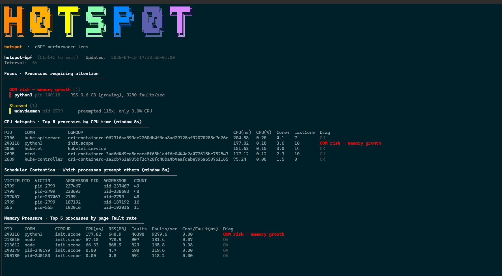

# hotspot-bpf

hotspot-bpf uses eBPF to turn raw kernel events into real-time performance explanations.
It correlates CPU time, scheduler contention, and page-fault pressure in a single window, revealing why a process is slow, starved, or heading toward OOM.
Traditional tools only show usage. hotspot shows **cause and effect**.

## Demo

We launch a Python memory leak, and as the process's RSS and fault rate cross the threshold, hotspot-bpf diagnoses it as an OOM-risk process by correlating CPU usage, page-fault rate, and RSS growth in real time.


`hotspot-bpf` combines **two tiny eBPF programs** with a Go TUI to answer the three questions that `top`, `htop`, and `perf` cannot answer together:

| What it reveals | Why it matters |
|------------------|----------------|
| Who is burning CPU? | Fast diagnosis of CPU-bound workloads |
| Who is stealing CPU? | Real victim/aggressor contention visibility |
| Who is stalling on memory faults? | Page-fault pressure & OOM risk detection |

All signals are sampled in **one sliding time window**, so **cause / effect** is visible instantly.

---

## What hotspot-bpf does (in one view)

- **Nanosecond-accurate CPU usage** via `sched/sched_switch`
- **Victim ↔ aggressor CPU contention** (which PID preempts which PID)
- **Real-time page fault rate** via `handle_mm_fault` kprobe
- **CPU cost per fault (ms)** — detects inefficient workloads  
- **Auto classification:**  
  `CPU-bound`, `Starved`, `Mem-thrashing`, `Noisy neighbor`, `OOM risk`, `OK`

> Traditional tools show these signals separately — hotspot cross-correlates them live.

---

## Why not top/htop/perf?

| hotspot-bpf | Traditional tools |
|-------------|-------------------|
| CPU + contention + page faults in one window | Only independent views |
| Victim/aggressor mapping | Total context switches only |
| Root-cause labels | Manual interpretation required |
| Uses eBPF tracepoints + kprobes | Mostly /proc sampling |
| cgroup-aware | Usually per-process only |

---

## Live Snapshot

```text
[!] Focus: python3 (pid 170276)
    Reason: OOM risk – memory growth – 1.1 GB RSS, 1103 faults/sec

[Top 5 CPU, window 5s]
PID     COMM        CGROUP                CPU(ms)  CPU(%)  Diag
170276  python3     session-518.scope     43.84    0.40    OOM risk – memory growth

[CPU Contention - last 5s]
No preemptions recorded in this window

[CPU Cost per Fault – CPU vs Page Faults]
PID     COMM        RSS(MB)  Faults/sec  CPU Cost/Fault (ms)  Diagnosis
170276  python3     1154.5   1102.6      0.01                 OOM risk – memory growth
```

## How it works

| File | Purpose |
|------|---------|
|bpf/cpu_hotspot.c | Tracepoint for sched/sched_switch → CPU time + contention map|
|bpf/memory_faults.c | Kprobe on handle_mm_fault → page faults per PID|
|pkg/collector/* | Go CO-RE wrappers (generated via bpf2go)|
|cmd/hotspot | TUI: focus banner + CPU table + contention + fault efficiency|

## Requirements (Linux only)

| Requirement | Why it matters | Official docs / references |
|-------------|----------------|-----------------------------|
| Linux kernel 5.8+ with BTF (`/sys/kernel/btf/vmlinux`) | Enables CO-RE relocation for eBPF programs (sched tracepoint & mm fault kprobe) | [Linux BPF docs](https://www.kernel.org/doc/html/latest/bpf/index.html) |
| Go 1.24+ | Builds the CLI and runs `bpf2go` | [Go installation guide](https://go.dev/doc/install) |
| Clang + LLVM 15+ / make / pkg-config / gcc | Compiles the eBPF object code used by `bpf2go` | [LLVM Getting Started guide](https://llvm.org/docs/GettingStarted.html) |
| Matching kernel headers (`linux-headers-$(uname -r)`) | Provides exact struct/API definitions required to compile eBPF / kernel-space related code | [Kernel Headers explained – Linux Kernel Newbies](https://kernelnewbies.org/KernelHeaders) |
| `bpftool` | Dumps BTF into `bpf/vmlinux.h` and manages eBPF programs/maps | [bpftool official site](https://bpftool.dev/) |
| `bpf2go` (from `cilium/ebpf`) | Generates Go bindings + object files for the eBPF collectors | [`bpf2go` repository](https://github.com/cilium/ebpf/tree/main/cmd/bpf2go) |

macOS/Windows can build the CLI but cannot run eBPF. Use Linux for runtime testing.

## Quick Start

```sh
git clone https://github.com/srodi/hotspot-bpf.git
cd hotspot-bpf

sudo apt install clang llvm bpftool gcc linux-headers-"$(uname -r)"

go install github.com/cilium/ebpf/cmd/bpf2go@latest
export PATH="$HOME/go/bin:$PATH"

sudo bpftool btf dump file /sys/kernel/btf/vmlinux format c > bpf/vmlinux.h
go generate ./...

sudo go run ./cmd/hotspot -interval 5s -topk 5
```

## Useful flags & tips

|Flag	|Description|
|-------------|-------------------|
|-interval 2s	| Faster sampling|
|-topk 10	Show | more rows|
|-hide-kernel=false	| Include kthreads|
|-cgroup-filter pods.slice | Scope to workloads|

## Testing CPU

```sh
yes > /dev/null &
sleep 10
pkill yes
```

## Testing Memory Fault Pressure

```sh
sudo stress-ng --vm 8 --vm-bytes 95% --vm-populate --vm-keep --timeout 30s
```

## Testing OOM Growth

```python
# memory leak
python3 - << 'EOF'
import time
x = []
while True:
    x.append(' ' * 10_000_000)  # 10MB per loop
    time.sleep(0.5)
EOF
```

Result:


