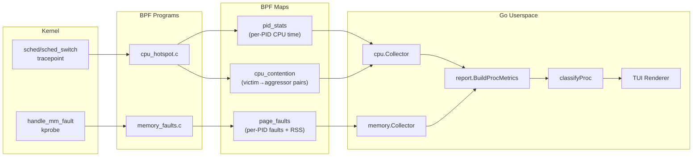
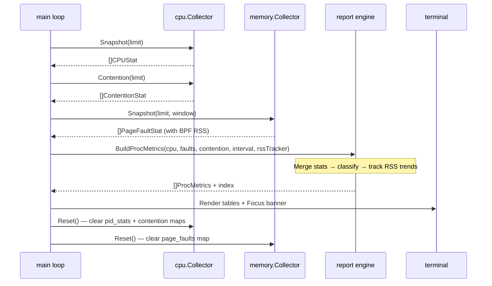
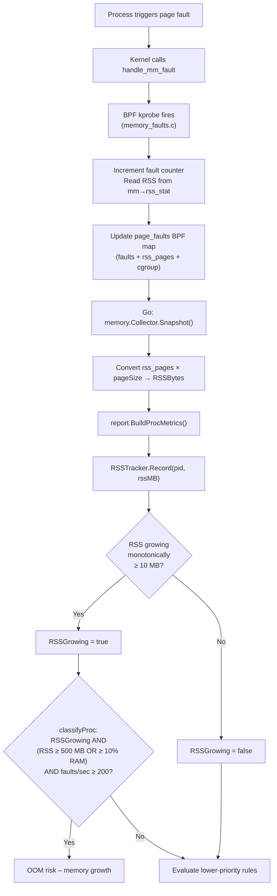
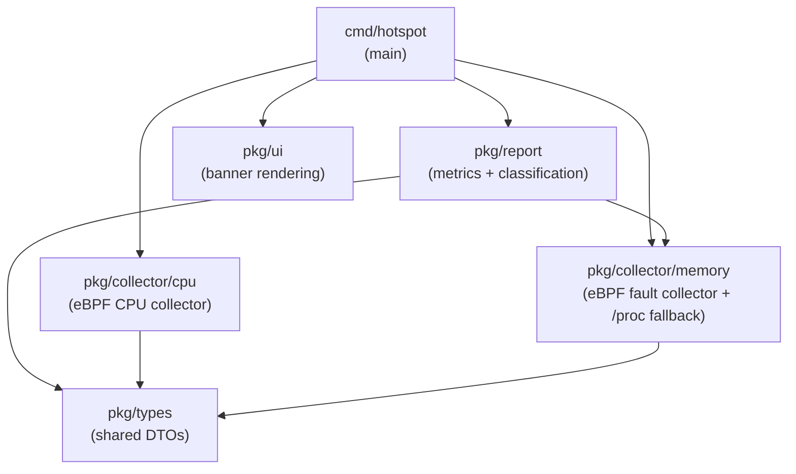
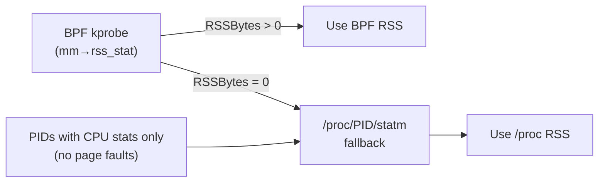

# Architecture

This document describes the internal design of hotspot-bpf: how kernel events
flow from eBPF programs through Go collectors into the TUI, and how each
component integrates with the others.

---

## High-Level Overview

---

## Tick Lifecycle

Every sampling interval (default 5s), the main loop executes this sequence.
The reset step at the end means all metrics are **windowed** — they reflect
only the activity since the previous tick, not cumulative totals.

If "No samples" appears in the TUI, it simply means no events were recorded
in that window — this is normal during idle periods.

---

## Data Flow: Page Fault → OOM Classification

This diagram traces how a single page fault event flows through the system
to produce an "OOM risk" classification.

---

## Component Integration

### Package dependency graph

### BPF ↔ Go struct alignment

The Go collector structs **must** match the C BPF struct layout byte-for-byte.
The BPF maps are read using raw memory iteration, so any mismatch silently
produces garbage data.

| C struct (`memory_faults.c`) | Go struct (`collector_linux.go`) | Size |
|------------------------------|----------------------------------|------|
| `u64 faults`                 | `Faults uint64`                  | 8    |
| `u64 rss_pages`              | `RSSPages uint64`                | 8    |
| `char cgroup[64]`            | `Cgroup [64]byte`                | 64   |
| **Total: 80 bytes**          | **Total: 80 bytes**              |      |

| C struct (`cpu_hotspot.c`)   | Go struct (`collector_linux.go`) | Size |
|------------------------------|----------------------------------|------|
| `u64 cpu_time_ns`            | `CPUTimeNS uint64`               | 8    |
| `char comm[16]`              | `Comm [16]byte`                  | 16   |
| `char cgroup[64]`            | `Cgroup [64]byte`                | 64   |
| `u32 cpu_id`                 | `CPUId uint32`                   | 4    |
| `u32 _pad`                   | `Pad uint32`                     | 4    |
| **Total: 96 bytes**          | **Total: 96 bytes**              |      |

> **`cpu_id`** is the last CPU core observed at switch-out via
> `bpf_get_smp_processor_id()`. It is NOT the "primary" core — a process
> may migrate between cores within a sampling window. The TUI labels it
> `LastCore` to reflect this.

### RSS data sources (primary + fallback)

The BPF source is preferred because `/proc` reads can fail silently for
short-lived or rapidly-forking processes, returning 0 and preventing OOM
classification.

---

## Limitations and Assumptions

- **Linux only**: requires kernel 5.8+ with BTF at `/sys/kernel/btf/vmlinux`.
- **Privileged**: must run as root (or with `CAP_BPF` + `CAP_PERFMON`).
- **kprobe dependency**: `handle_mm_fault` is not a stable ABI — kernel
  updates could rename or refactor it (unlikely but possible).
- **Windowed metrics**: all stats are per-tick. A process that exits
  mid-window may appear with partial data or not at all.
- **Cgroup names are best-effort**: the BPF program reads the leaf kernfs
  node name, not the full cgroup path. This is sufficient for identification
  but not for precise cgroup hierarchy queries.
- **RSS is approximate**: the BPF read uses the `percpu_counter.count` base
  value. Per-CPU deltas are omitted, so the value may be off by a few MB.
- **Diagnoses are heuristics**: labels like "OOM risk" indicate elevated
  probability, not certainty. Always corroborate with other tools before
  taking action (e.g., `dmesg`, `oom_score_adj`, cgroup memory limits).
- **CPU core is last-observed**: the `LastCore` column shows the core at the
  most recent context switch, not the core where the process spent the most
  time. Migratory workloads may show different cores each tick.
- **Core CPU% can exceed 100%**: if a process migrates between cores within
  a tick, its accumulated CPU time may exceed one core's capacity.
- **Colors require a TTY**: ANSI colors are automatically disabled when stdout
  is not a terminal, when `NO_COLOR` is set, or when `TERM=dumb`.
